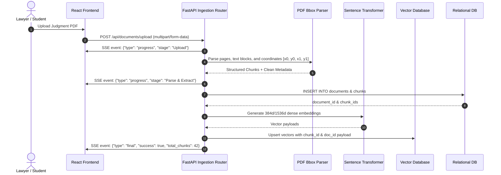

# LexLink System Architecture & Technical Design

This document details the overarching architectural blueprint of the **LexLink** platform, explaining how the Python FastAPI backend, React 19 Vite frontend, PostgreSQL database, and Qdrant vector database interact seamlessly.

---

## 🏛️ High-Level System Architecture

```mermaid
flowchart TB
    subgraph Client["Frontend Client (React 19 + Vite + TypeScript)"]
        UI[Pages & Modular Components]
        API_C[Axios API Client + SSE Handler]
        PDF_V[PDF.js + Bbox Overlay Viewer]
    end

    subgraph Gateway["API Gateway & Middleware"]
        CORS[CORS Handler]
        AUTH_M[JWT Auth & RBAC Middleware]
        RATE[Rate Limiter (Redis Token Bucket)]
    end

    subgraph Backend["Python FastAPI Application (backend/app/)"]
        ROUTERS[Feature Routers]
        EXTRACTOR[PyMuPDF Bbox Extractor]
        EMBED_SVC[Embedding Service (MiniLM / OpenAI)]
        RAG_SVC[RAG & Citation Linker]
        LLM_SVC[Claude 3.5 Sonnet / OpenAI Client]
    end

    subgraph Storage["Data Persistence Layer"]
        PG[(PostgreSQL / Supabase)]
        QDRANT[(Qdrant Vector DB)]
        OBJ[(Cloud Object Storage - S3 / Local)]
        REDIS[(Redis Cache & Session Store)]
    end

    UI --> API_C
    API_C --> Gateway
    Gateway --> Backend
    
    ROUTERS --> EXTRACTOR
    ROUTERS --> RAG_SVC
    EXTRACTOR --> OBJ
    RAG_SVC --> EMBED_SVC
    EMBED_SVC --> QDRANT
    RAG_SVC --> LLM_SVC
    ROUTERS --> PG
    AUTH_M --> REDIS
```

---

## 🔄 End-to-End Document Ingestion & RAG Data Flow



---

## 🧱 Key Architectural Principles

1. **Strict Decoupling:** The frontend and backend communicate strictly over JSON REST APIs and Server-Sent Events (SSE). No server-side HTML rendering or tight coupling.
2. **Deterministic Bounding Boxes:** Every chunk extracted from legal PDFs retains exact page coordinates `[x0, y0, x1, y1]`. When the AI assistant cites a precedent, the frontend can highlight the exact paragraph in the PDF viewer.
3. **Stateless Scalability:** FastAPI backend instances are fully stateless. Authentication relies on cryptographically signed JWT tokens, and user state is stored in PostgreSQL / Redis.
4. **Resilient Vector Retrieval:** Vector search queries in Qdrant use payload filtering (e.g., filtering by court, year, and jurisdiction) prior to calculating cosine similarity to ensure sub-100ms retrieval latencies.
