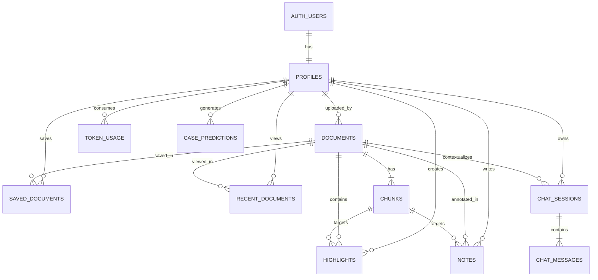

# LexLink Database Schema Specification (Supabase / PostgreSQL)

This document represents the active database schema configured in Supabase / PostgreSQL for the **LexLink** platform.

---

## 📊 Entity Relationship Diagram (ERD)



---

## 🗄️ Database DDL (Production Supabase Schema)

```sql
-- ============================================
-- Enable UUID generation
-- ============================================
create extension if not exists "pgcrypto";

-- ============================================
-- Profiles (Tied to Supabase auth.users)
-- ============================================
create table public.profiles (
    id uuid primary key references auth.users(id) on delete cascade,
    name text,
    role text not null
        check (role in ('layman', 'lawyer', 'admin')),
    license_no text,
    cnic text,
    verification_status text
        default 'not_required'
        check (
            verification_status in (
                'not_required',
                'pending',
                'approved',
                'rejected'
            )
        ),
    created_at timestamptz default now()
);

-- ============================================
-- Documents (Scalable Clean Schema with JSONB metadata)
-- ============================================
create table public.documents (
    id uuid primary key default gen_random_uuid(),
    title text,
    court_type text not null
        check (court_type in ('SC', 'HC')),
    source_file text,
    pdf_url text,
    total_lines integer default 0,
    total_chunks integer default 0,
    metadata jsonb default '{}'::jsonb,
    uploaded_by uuid
        references public.profiles(id)
        on delete set null,
    created_at timestamptz default now()
);

-- ============================================
-- Chunks
-- ============================================
create table public.chunks (
    id uuid primary key default gen_random_uuid(),
    document_id uuid not null
        references public.documents(id)
        on delete cascade,
    chunk_index integer not null,
    text text not null,
    word_count integer,
    page_start integer not null,
    page_end integer not null,
    bbox jsonb,
    qdrant_point_id uuid,
    source_file text,
    created_at timestamptz default now()
);

-- ============================================
-- Ingestion Failures
-- ============================================
create table public.ingestion_failures (
    id uuid primary key default gen_random_uuid(),
    source_file text,
    court_type text,
    reason text,
    created_at timestamptz default now()
);

-- ============================================
-- Saved Documents
-- ============================================
create table public.saved_documents (
    id uuid primary key default gen_random_uuid(),
    user_id uuid
        references public.profiles(id)
        on delete cascade,
    document_id uuid
        references public.documents(id)
        on delete cascade,
    saved_at timestamptz default now(),
    unique(user_id, document_id)
);

-- ============================================
-- Recent Documents
-- ============================================
create table public.recent_documents (
    id uuid primary key default gen_random_uuid(),
    user_id uuid
        references public.profiles(id)
        on delete cascade,
    document_id uuid
        references public.documents(id)
        on delete cascade,
    last_opened_at timestamptz default now(),
    unique(user_id, document_id)
);

-- ============================================
-- Highlights
-- ============================================
create table public.highlights (
    id uuid primary key default gen_random_uuid(),
    user_id uuid
        references public.profiles(id)
        on delete cascade,
    document_id uuid
        references public.documents(id)
        on delete cascade,
    chunk_id uuid
        references public.chunks(id)
        on delete cascade,
    bbox jsonb,
    created_at timestamptz default now()
);

-- ============================================
-- Notes
-- ============================================
create table public.notes (
    id uuid primary key default gen_random_uuid(),
    user_id uuid
        references public.profiles(id)
        on delete cascade,
    document_id uuid
        references public.documents(id)
        on delete cascade,
    chunk_id uuid
        references public.chunks(id)
        on delete cascade,
    content text,
    created_at timestamptz default now()
);

-- ============================================
-- Chat Sessions
-- ============================================
create table public.chat_sessions (
    id uuid primary key default gen_random_uuid(),
    user_id uuid
        references public.profiles(id)
        on delete cascade,
    document_id uuid
        references public.documents(id)
        on delete set null,
    session_type text
        check (
            session_type in (
                'general',
                'document',
                'layman'
            )
        ),
    created_at timestamptz default now()
);

-- ============================================
-- Chat Messages
-- ============================================
create table public.chat_messages (
    id uuid primary key default gen_random_uuid(),
    session_id uuid
        references public.chat_sessions(id)
        on delete cascade,
    sender text
        check (sender in ('user', 'ai')),
    content text,
    created_at timestamptz default now()
);

-- ============================================
-- Token Usage
-- ============================================
create table public.token_usage (
    id uuid primary key default gen_random_uuid(),
    user_id uuid
        references public.profiles(id)
        on delete cascade,
    tokens_used integer,
    request_type text,
    usage_date date default current_date
);

-- ============================================
-- Case Predictions
-- ============================================
create table public.case_predictions (
    id uuid primary key default gen_random_uuid(),
    user_id uuid
        references public.profiles(id)
        on delete cascade,
    case_description text,
    win_probability numeric(5,2),
    reference_document_ids uuid[],
    strengths text,
    weaknesses text,
    created_at timestamptz default now()
);

-- ============================================
-- Legal Dictionary
-- ============================================
create table public.legal_dictionary (
    id uuid primary key default gen_random_uuid(),
    term text not null,
    language text
        check (
            language in (
                'en',
                'ur',
                'roman_ur'
            )
        ),
    definition text,
    created_at timestamptz default now()
);

-- ============================================
-- Performance Indexes
-- ============================================
create index idx_documents_court_type on public.documents(court_type);
create index idx_documents_created_at on public.documents(created_at desc);
create index idx_documents_metadata on public.documents using gin(metadata);

create index idx_chunks_document on public.chunks(document_id);
create index idx_chunks_qdrant on public.chunks(qdrant_point_id);

create index idx_saved_documents_user on public.saved_documents(user_id);
create index idx_recent_documents_user on public.recent_documents(user_id);

create index idx_highlights_user on public.highlights(user_id);
create index idx_notes_user on public.notes(user_id);

create index idx_chat_sessions_user on public.chat_sessions(user_id);
create index idx_chat_messages_session on public.chat_messages(session_id);

create index idx_token_usage_user on public.token_usage(user_id);
create index idx_case_predictions_user on public.case_predictions(user_id);
create index idx_dictionary_term on public.legal_dictionary(term);
```

---

## 📝 Document Table Notes & Observational Review

> [!NOTE]
> **Scalable JSONB Metadata Architecture:**
> The `documents` table stores core system and routing fields (`title`, `court_type`, `source_file`, `pdf_url`, `total_lines`, `total_chunks`, `uploaded_by`) as top-level columns, while all dynamic, variable, and extracted case metadata (`court`, `case_number`, `judge`, `parties`, `date`, `dates_of_hearing`, `boilerplate_removed`, `advocates`, etc.) are encapsulated in `metadata` (JSONB).
> A `GIN` index (`idx_documents_metadata`) is applied on `metadata` to guarantee sub-millisecond JSONB query performance at massive scale across millions of judgment records.
