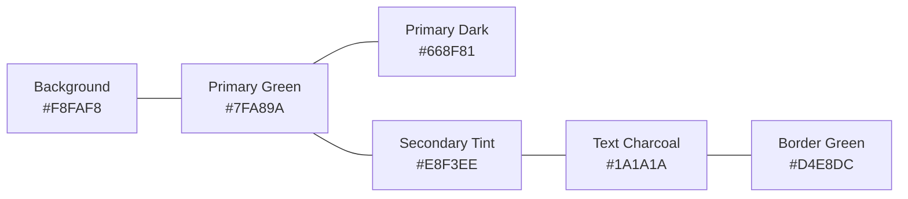

# LexLink Design System Specification

This document defines the official visual design language, color palette, typography hierarchy, component patterns, and accessibility standards for the **LexLink** user interface.

---

## 🎨 1. Core Color Palette (Light Sage Green Theme)

LexLink uses a refined **Light Sage Green** aesthetic designed for high-focus legal research, reading comfort, and understated professional authority.

### Color Palette Reference

| Token Name | Hex Code | HSL Equivalent | Primary Usage |
| :--- | :--- | :--- | :--- |
| **`color-bg`** | `#F8FAF8` | `hsl(120, 14%, 98%)` | Main app background, subtle mint tint |
| **`color-surface`** | `#FFFFFF` | `hsl(0, 0%, 100%)` | Card surface, modal body, dropdown menu |
| **`color-primary`** | `#7FA89A` | `hsl(161, 20%, 57%)` | Primary buttons, active tabs, brand accents |
| **`color-primary-dark`** | `#668F81` | `hsl(161, 20%, 48%)` | Button hover states, prominent badges |
| **`color-secondary`** | `#E8F3EE` | `hsl(150, 29%, 93%)` | Secondary buttons, highlighted cards, chips |
| **`color-text-primary`**| `#1A1A1A` | `hsl(0, 0%, 10%)` | Main headings, body text, high-contrast labels |
| **`color-text-muted`**  | `#52605B` | `hsl(158, 8%, 35%)` | Subtitles, metadata, timestamps, placeholders |
| **`color-border`**      | `#D4E8DC` | `hsl(143, 27%, 87%)` | Card borders, dividers, table borders |
| **`color-highlight`**   | `#7FA89A4D`| `hsla(161, 20%, 57%, 0.3)` | PDF bounding-box highlight overlay |

### Feedback & Status Colors

| Token Name | Hex Code | Usage |
| :--- | :--- | :--- |
| **`color-success`** | `#38A169` | Verified badges, successful ingestion, positive predictions |
| **`color-warning`** | `#DD6B20` | Pending verification, rate-limit warnings, caution notes |
| **`color-danger`**  | `#E53E3E` | Failed ingestion, errors, delete confirmation, critical alerts |
| **`color-info`**    | `#3182CE` | Tooltips, informational callouts, link buttons |

---

## ✍️ 2. Typography System

LexLink pairs **authoritative Serif typography** for headings (reminiscent of official legal judgments and court rulings) with **crisp, modern Sans-serif** for body text and interactive elements.

### Font Families
- **Headings (Legal Authority):** `'Georgia', 'Garamond', 'Merriweather', serif`
- **Body & UI Elements:** `system-ui, -apple-system, 'Segoe UI', 'Inter', Roboto, sans-serif`
- **Code & Citations:** `'JetBrains Mono', 'Fira Code', 'Courier New', monospace`

### Type Scale & Hierarchy

| Element | Font Family | Size | Weight | Line Height | Tracking |
| :--- | :--- | :--- | :--- | :--- | :--- |
| **Display / H1** | Serif | `36px` (`2.25rem`) | `700` (Bold) | `1.2` | `-0.02em` |
| **Page Title / H2** | Serif | `28px` (`1.75rem`) | `600` (SemiBold) | `1.3` | `-0.01em` |
| **Section Title / H3**| Serif | `22px` (`1.375rem`)| `600` (SemiBold) | `1.4` | `0` |
| **Card Header / H4** | Sans | `18px` (`1.125rem`)| `600` (SemiBold) | `1.4` | `0` |
| **Body (Default)** | Sans | `16px` (`1.0rem`)  | `400` (Regular) | `1.6` | `0` |
| **Body (Medium)** | Sans | `16px` (`1.0rem`)  | `500` (Medium)  | `1.6` | `0` |
| **Caption / Meta** | Sans | `14px` (`0.875rem`)| `400` (Regular) | `1.5` | `0.01em` |
| **Micro / Tag** | Sans | `12px` (`0.75rem`) | `600` (SemiBold)| `1.4` | `0.02em` |

---

## 📐 3. Spacing & Elevation Scale

### Spacing System (4px Base Grid)
- `2xs` (`4px`), `xs` (`8px`), `sm` (`12px`), `md` (`16px`), `lg` (`20px`), `xl` (`24px`), `2xl` (`32px`), `3xl` (`48px`), `4xl` (`64px`).

### Soft Shadow Tokens (Diffused, non-harsh)
- **`shadow-sm`**: `0 1px 2px 0 rgba(0, 0, 0, 0.04)`
- **`shadow-md`**: `0 4px 6px -1px rgba(0, 0, 0, 0.06), 0 2px 4px -1px rgba(0, 0, 0, 0.03)`
- **`shadow-lg`**: `0 10px 15px -3px rgba(0, 0, 0, 0.07), 0 4px 6px -2px rgba(0, 0, 0, 0.04)`
- **`shadow-card`**: `0 2px 8px rgba(127, 168, 154, 0.12)`

### Border Radius
- **Inputs & Buttons:** `8px` (`rounded-lg`)
- **Cards & Modals:** `12px` (`rounded-xl`)
- **Badges & Avatars:** `9999px` (`rounded-full`)

---

## 🧩 4. Core Component Patterns

### 4.1 Buttons
- **Primary Button:** Background `#7FA89A`, Text `#FFFFFF`, Hover `#668F81`, Active scale `0.98`, Focus ring `2px solid #7FA89A`.
- **Secondary Button:** Background `#E8F3EE`, Text `#1A1A1A`, Border `1px solid #D4E8DC`, Hover Background `#D4E8DC`.
- **Outline Button:** Background `transparent`, Border `1.5px solid #7FA89A`, Text `#52605B`, Hover Background `#E8F3EE`.
- **Ghost Button:** Background `transparent`, Text `#52605B`, Hover Background `#E8F3EE`.

### 4.2 Cards & Containers
- White background (`#FFFFFF`), `1px solid #D4E8DC` border, `12px` border radius, `shadow-card`, padding `20px` to `24px`.
- Hover transition: `border-color #7FA89A`, `transform translateY(-2px)`, smooth `200ms ease`.

### 4.3 Chat Bubbles
- **User Message:** Background `#E8F3EE`, Border `1px solid #D4E8DC`, Text `#1A1A1A`, Rounded `16px 16px 4px 16px`.
- **AI Legal Assistant:** Background `#FFFFFF`, Border `1px solid #D4E8DC`, Text `#1A1A1A`, Rounded `16px 16px 16px 4px`, with embedded interactive citation badges.

### 4.4 Status Badges
- **Verified:** Background `#DEF7EC`, Text `#03543F`, Border `#BCF0DA`
- **Pending:** Background `#FEF08A`, Text `#854D0E`, Border `#FDE047`
- **Lawyer Tag:** Background `#E8F3EE`, Text `#2C5E4F`, Border `#D4E8DC`

---

## ♿ 5. Accessibility & Contrast Compliance (WCAG AA)

- All text meets **WCAG AA** minimum contrast ratio (4.5:1 for body text `#1A1A1A` on `#F8FAF8` = `14.8:1`).
- All interactive controls feature visible focus indicators: `outline: none; ring: 2px solid #7FA89A; ring-offset: 2px`.
- Screen-reader text (`sr-only`) provided for icon-only buttons.
