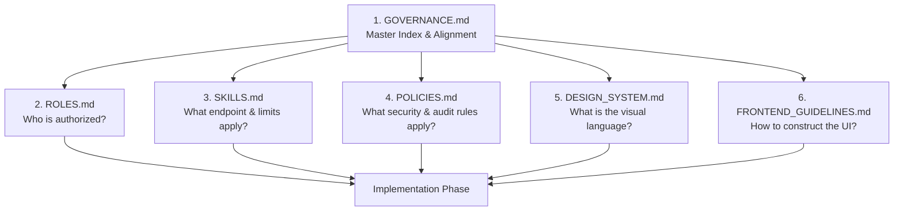

# LexLink Governance & Architectural Index

Welcome to the central governance blueprint for **LexLink** — an AI-powered legal intelligence, case prediction, and document analysis platform.

This document serves as the master index and navigation hub for all architectural, operational, security, and design documentation. Every developer, architect, and AI agent working on LexLink **must** consult this index before planning, implementing, or reviewing features.

---

## 📚 Master Documentation Map

```
lexlink/
└── docs/
    ├── GOVERNANCE.md          ← [YOU ARE HERE] Master index, policies, & checklists
    ├── ROLES.md               ← User roles, permission matrix, & verification flows
    ├── SKILLS.md              ← Capability catalog, endpoints, rate limits, & tokens
    ├── POLICIES.md            ← Security, encryption, GDPR, audit logs, & SLAs
    ├── DESIGN_SYSTEM.md       ← Sage green palette, typography, shadows, & UI tokens
    ├── FRONTEND_GUIDELINES.md ← React 19 + TSX patterns, layout components, & CSS
    ├── ARCHITECTURE.md        ← Decoupled FastAPI + Vite architecture & data flows
    ├── DB_SCHEMA.md           ← Complete relational schema, indexes, & migrations
    ├── API_ENDPOINTS.md       ← Complete REST & Streaming API catalog
    ├── RAG_PIPELINE.md        ← PDF bbox chunking, Qdrant vectors, & LLM context
    └── SETUP_GUIDE.md         ← Developer onboarding, environment vars, & scripts
```

---

## 🧭 How All Documents Work Together

When executing any task or feature implementation, follow the **Hierarchical Decision Chain**:



---

## ⚖️ Role-Skill-Policy Alignment Matrix

| Category | Primary Skills | Accessible Roles | Key Security & Compliance Policies |
| :--- | :--- | :--- | :--- |
| **Authentication & Profile** | `auth.signup`, `auth.login`, `auth.verify_credentials` | All (Layman, Student, Lawyer, Admin) | Argon2id password hashing, JWT RS256 token pairs, Rate limiting (5 req/min) |
| **Document Ingestion** | `documents.upload`, `documents.stream_process`, `documents.list` | Student, Lawyer, Admin | Temp file sanitization, PyMuPDF bbox parsing, Virus scanning, Ownership checks |
| **Bbox Chunks & Viewer** | `chunks.get_metadata`, `chunks.get_page_bboxes` | Student, Lawyer, Admin | Document ID tenancy isolation, Cached vector lookups |
| **Highlights & Notes** | `highlights.create`, `highlights.list`, `notes.crud` | Student, Lawyer, Admin | User-level tenancy, strictly private unless shared, soft deletion |
| **Vector Search & RAG** | `search.vector_search`, `search.hybrid_search` | Student, Lawyer, Admin | Qdrant score thresholding, Role-based document visibility filters |
| **Legal AI Assistant** | `chat.create_session`, `chat.stream_message` | Student, Lawyer, Admin | Session token quotas, Context truncation defense, Prompt injection guardrails |
| **Layman Prediction** | `predictions.case_outcome`, `dictionary.lookup` | Layman, Student, Lawyer, Admin | Clear disclaimer policy, Plain-language tone enforcement |
| **Admin & Governance** | `admin.analytics`, `admin.token_usage`, `admin.audit_logs` | Admin Only | Immutable audit log trail, Masked PII in dashboards, Strict RBAC enforcement |

---

## 🔒 Security Checklist for Every Endpoint

Before releasing or committing any API endpoint in `backend/app/routers/`:

- [ ] **Authentication Check:** Is the endpoint protected by `get_current_user` dependency unless explicitly public?
- [ ] **Role Authorization Check:** Are user roles verified using `require_role(["Lawyer", "Admin"])`?
- [ ] **Tenancy & Ownership Check:** Does the query ensure `WHERE user_id = current_user.id` (or user is Admin)?
- [ ] **Input Validation:** Are all request inputs validated using strict Pydantic schemas (no arbitrary dicts)?
- [ ] **SQL / Injection Defense:** Are all database queries parameterized via SQLAlchemy ORM (zero raw string concatenations)?
- [ ] **Rate Limiting:** Is a rate limiter configured for this endpoint in `SKILLS.md`?
- [ ] **Audit Logging:** Are sensitive actions (verification approval, document deletion, role change) recorded in `audit_logs`?
- [ ] **Error Sanitization:** Does the endpoint avoid leaking stack traces, database details, or server paths to the client?

---

## 🛠️ Feature Implementation Workflow

When an AI Agent or Developer is tasked with creating a feature (e.g., *"Build the Judgment Search Page"*):

1. **Governance Check:** Read [GOVERNANCE.md](file:///d:/LexLink/docs/GOVERNANCE.md) to understand dependencies.
2. **Role Verification:** Check [ROLES.md](file:///d:/LexLink/docs/ROLES.md) to determine allowed roles and data visibility rules.
3. **Skill & Endpoint Contract:** Check [SKILLS.md](file:///d:/LexLink/docs/SKILLS.md) for request/response payloads, HTTP verbs, and rate limits.
4. **Security & Policies:** Check [POLICIES.md](file:///d:/LexLink/docs/POLICIES.md) for required audit log triggers and security validations.
5. **Visual Design Tokens:** Check [DESIGN_SYSTEM.md](file:///d:/LexLink/docs/DESIGN_SYSTEM.md) for the Sage Green palette, typography, borders, and shadows.
6. **Frontend Patterns:** Check [FRONTEND_GUIDELINES.md](file:///d:/LexLink/docs/FRONTEND_GUIDELINES.md) for React component structure, loading states, and CSS classes.
7. **Database & API:** Check [DB_SCHEMA.md](file:///d:/LexLink/docs/DB_SCHEMA.md) and [API_ENDPOINTS.md](file:///d:/LexLink/docs/API_ENDPOINTS.md) to write clean backend models, routers, and queries.
8. **Verification:** Run unit/integration tests and verify responsive layout across mobile, tablet, and desktop viewports.
