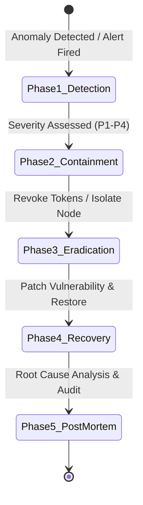

# LexLink Security, Compliance & Data Governance Policies

This document establishes the mandatory security controls, data governance rules, audit logging standards, incident response protocols, and Service Level Agreements (SLAs) across the LexLink platform.

---

## 🔒 1. Security & Cryptographic Policies

### 1.1 Data Encryption Standards
- **In Transit:** All external and internal communication must enforce **TLS 1.3** (fallback to TLS 1.2 minimum). Plain HTTP and unencrypted WebSocket connections are strictly blocked.
- **At Rest:**
  - PostgreSQL / Supabase storage volumes encrypted via **AES-256 (XTS-AES-256)**.
  - Uploaded PDF judgment files in cloud object storage (S3/GCS) use server-side encryption with customer-managed keys (SSE-KMS).
  - Sensitive database columns (e.g., `mfa_secret`, `bar_council_number`) encrypted with application-layer **Fernet (AES-128-CBC + HMAC-SHA256)**.

### 1.2 Authentication & JWT Token Lifecycle
- **Access Tokens:** Short-lived JWTs (Expiration: **15 minutes**), signed via **RS256** (Asymmetric) or **HS256** with strong secret key.
- **Refresh Tokens:** Long-lived tokens (Expiration: **7 days**), stored securely in HttpOnly, Secure, SameSite=Strict cookies.
- **Token Rotation & Revocation:** Every refresh token exchange issues a new token pair and invalidates the previous refresh token. A Redis-backed revocation blacklist tracks compromised tokens.
- **Password Security:**
  - Hashing algorithm: **Argon2id** (memory: 64MB, iterations: 3, parallelism: 4) or **bcrypt** with work factor 12.
  - Minimum password length: **10 characters**, requiring uppercase, lowercase, numeric, and special characters.

### 1.3 Rate Limiting & DoS Mitigation
- Rate limiting implemented at API gateway and FastAPI middleware layer using a **Redis Token Bucket Algorithm**.
- Public endpoints (Login, Signup): Max 5-10 requests/minute per IP.
- Authenticated endpoints: Standard per-role quotas as defined in [SKILLS.md](file:///d:/LexLink/docs/SKILLS.md).

---

## 🛡️ 2. Data Governance & Privacy (GDPR & Data Protection)

### 2.1 Principles of Legal Data Handling
1. **Public vs. Confidential Split:** Official court judgments are categorized as Public Legal Records. Client-uploaded confidential briefs, personal highlights, and sticky notes are strictly categorized as **Confidential User Data**.
2. **Tenancy Isolation:** Multi-tenancy is enforced at the database query level (`WHERE user_id = :current_user_id`). Cross-tenant document visibility is impossible without explicit sharing permissions.
3. **Right to Erasure ("Forget Me"):** Users can request complete account deletion. All personal notes, highlights, chat histories, and verification documents are permanently purged within 72 hours.
4. **Data Portability:** Users can export all their created highlights, research summaries, and notes in JSON/PDF formats at any time.

### 2.2 Data Retention Schedule

| Data Category | Retention Period | Post-Expiry Action |
| :--- | :--- | :--- |
| **Ingestion Temp Files** | Max 10 minutes | Instant disk wipe after PyMuPDF extraction |
| **User Highlights & Notes** | Active account lifetime | Retained until user deletion |
| **Deleted Account Data** | 30 days grace period | Hard delete from DB & object store |
| **AI Chat Sessions** | 180 days (or user clears) | Automated archival or soft-delete |
| **Security Audit Logs** | 365 days minimum | Immutable archival storage |
| **Failed Verification Uploads** | 90 days | Hard deleted for privacy compliance |

---

## 📋 3. Audit Logging & Security Tracing

### 3.1 Auditable Event Catalog
The system must log the following events to the `audit_logs` table in real time:
- `AUTH_LOGIN_SUCCESS` & `AUTH_LOGIN_FAILURE` (tracks IP, user-agent, timestamp)
- `AUTH_PASSWORD_RESET`
- `ROLE_VERIFICATION_SUBMITTED`, `ROLE_VERIFICATION_APPROVED`, `ROLE_VERIFICATION_REJECTED`
- `DOCUMENT_UPLOADED`, `DOCUMENT_DELETED`
- `ADMIN_USER_SUSPENDED`, `ADMIN_QUOTA_OVERRIDE`

### 3.2 Audit Log Schema

```sql
CREATE TABLE audit_logs (
    id UUID PRIMARY KEY DEFAULT gen_random_uuid(),
    event_type VARCHAR(100) NOT NULL,
    actor_id UUID REFERENCES users(id) ON DELETE SET NULL,
    actor_ip VARCHAR(45) NOT NULL,
    actor_user_agent TEXT,
    resource_type VARCHAR(50),
    resource_id VARCHAR(100),
    details JSONB DEFAULT '{}'::jsonb,
    created_at TIMESTAMP WITH TIME ZONE DEFAULT CURRENT_TIMESTAMP
);

CREATE INDEX idx_audit_event_type ON audit_logs(event_type);
CREATE INDEX idx_audit_actor ON audit_logs(actor_id);
CREATE INDEX idx_audit_created ON audit_logs(created_at);
```

---

## 🚨 4. Incident Response & Breach Management



### Incident Severity Levels & SLAs

| Severity | Definition | Response SLA | Resolution Target |
| :--- | :--- | :--- | :--- |
| **P1 - Critical** | Data breach, total system outage, active unauthorized access | **15 minutes** | < 4 hours |
| **P2 - High** | RAG vector search failure, login outage for a role, degraded API | **30 minutes** | < 8 hours |
| **P3 - Medium** | Non-critical feature bug, minor UI issue, slow chunking | **2 hours** | < 24 hours |
| **P4 - Low** | Minor cosmetic styling issue, non-urgent documentation update | **1 business day** | Next release cycle |

---

## ⏱️ 5. Operational SLAs & Performance Budgets

- **Platform Uptime:** **99.9%** availability (excluding scheduled maintenance).
- **API Response Latency Budget (P95):**
  - Standard REST Endpoints (Auth, Documents, Notes): `< 150ms`
  - Vector Similarity Search (Qdrant): `< 250ms`
  - PDF Ingestion & PyMuPDF Parsing (50-page document): `< 3.5 seconds`
  - Streaming Chat RAG (Time to First Token - TTFT): `< 1.2 seconds`
