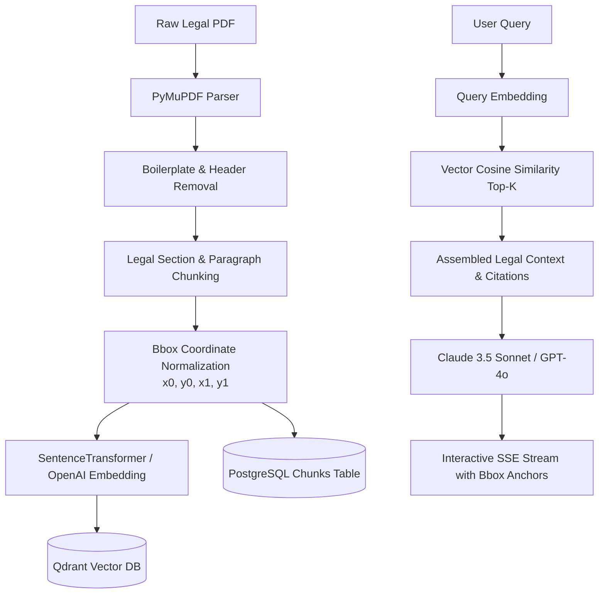

# LexLink RAG & Bounding-Box Vector Pipeline

This document details the exact engineering specification for PDF ingestion, PyMuPDF bounding-box extraction, vector embedding, Qdrant indexing, and grounded LLM generation with interactive citations.

---

## 🔬 Pipeline Flowchart



---

## 1. PyMuPDF Bounding-Box Extraction Algorithm

PyMuPDF (`fitz`) extracts text alongside exact geometric bounding boxes for every block and line on each page:

```python
# backend/app/services/pdf_extractor.py
import fitz  # PyMuPDF

def extract_page_chunks_with_bbox(pdf_path: str):
    doc = fitz.open(pdf_path)
    extracted_chunks = []

    for page_num in range(len(doc)):
        page = doc[page_num]
        rect = page.rect
        page_width, page_height = rect.width, rect.height
        
        # Extract structured text blocks with coordinates
        blocks = page.get_text("blocks")
        for block_idx, block in enumerate(blocks):
            x0, y0, x1, y1, text, block_no, block_type = block
            
            # Filter boilerplate headers / page numbers
            clean_text = text.strip()
            if not clean_text or len(clean_text) < 15:
                continue
                
            extracted_chunks.append({
                "page_number": page_num + 1,
                "chunk_index": block_idx,
                "text": clean_text,
                "bbox": [round(x0, 2), round(y0, 2), round(x1, 2), round(y1, 2)],
                "page_dimensions": {"width": page_width, "height": page_height}
            })
            
    return extracted_chunks
```

---

## 2. Qdrant Vector Collection Configuration

### Collection Setup
- **Collection Name:** `lexlink_judgments`
- **Vector Dimension:** `384` (for `all-MiniLM-L6-v2`) or `1536` (for `text-embedding-3-small`)
- **Distance Metric:** `Cosine`

### Payload Schema in Qdrant
```json
{
  "chunk_id": "c8b7f83a-45c1-4b77-8092-23f2780e909a",
  "document_id": "93b8d4f0-21a4-4f4a-939e-4c8d2091e843",
  "case_number": "SC-109/2022",
  "court": "Supreme Court",
  "year": 2022,
  "page_number": 4,
  "bbox": [72.0, 140.5, 520.0, 210.2],
  "text": "The doctrine of legitimate expectation applies when..."
}
```

### Fast Payload Indexes
```python
from qdrant_client import QdrantClient
from qdrant_client.http import models

client = QdrantClient(url="http://localhost:6333")

# Index fields for instant filtering
client.create_payload_index(
    collection_name="lexlink_judgments",
    field_name="document_id",
    field_schema=models.PayloadSchemaType.KEYWORD
)
client.create_payload_index(
    collection_name="lexlink_judgments",
    field_name="court",
    field_schema=models.PayloadSchemaType.KEYWORD
)
```

---

## 3. RAG Grounded System Prompt Template

```markdown
You are LexLink, an elite AI Legal Research Assistant specializing in judicial precedents, statutory interpretation, and case ratio analysis.

### Context Provided:
{retrieved_chunks_with_citations}

### Instructions:
1. Base your answer strictly on the provided case context and statutory provisions.
2. Every significant legal proposition or factual deduction MUST cite the exact page and paragraph using the format: `[Citation: Case Title, Page X, Para Y, chunk_id: UUID]`.
3. If the context does not contain sufficient grounds to answer, explicitly state what is missing.
4. Maintain an objective, authoritative, and precise legal tone.
```

---

## 4. Frontend Interactive Citation Click Interaction

When the user clicks a citation badge in the AI response:
1. The frontend parses the `chunk_id` and `bbox` from the citation payload.
2. The `DocumentViewer` scrolls to the target `page_number`.
3. The `HighlightOverlay` renders an animated translucent sage green rectangle around `[x0, y0, x1, y1]`, drawing immediate visual focus to the exact text in the PDF.
