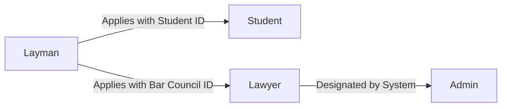
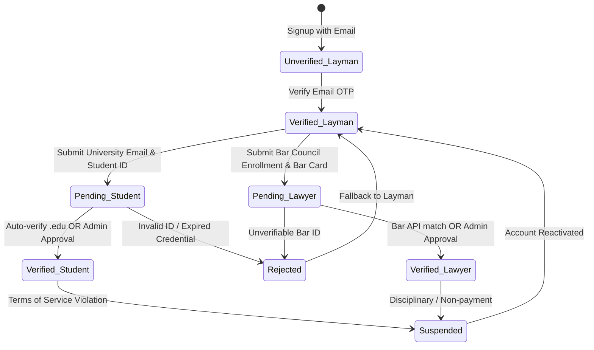

# LexLink Roles, Permissions & Verification Specification

This document defines the 4 user roles in LexLink, the granular permission matrix, user verification lifecycle, and database structures required for Role-Based Access Control (RBAC).

---

## 👥 The 4 User Personas



### 1. Layman (General Public / Citizen)
- **Profile:** Non-lawyers, litigants, general citizens seeking simple legal awareness, case outcomes, or understanding complex legal jargon.
- **Key Objectives:** Plain-language case summaries, legal term dictionary lookups, basic case outcome predictions, and connecting with verified lawyers.
- **Verification Level:** Level 1 (Email / Phone OTP verification).

### 2. Student (Law Student / Academic Researcher)
- **Profile:** LLB/LLM students, legal researchers, and academic interns.
- **Key Objectives:** Full judgment analysis, PDF search, citation analysis, bounding-box highlighting, personal sticky notes, and AI legal research chat.
- **Verification Level:** Level 2 (University email verification + Student ID card verification).

### 3. Lawyer (Advocate / Legal Practitioner)
- **Profile:** Licensed attorneys, advocates of High Courts / Supreme Court, and law firm associates.
- **Key Objectives:** Full document ingestion, deep RAG semantic vector search, advanced case law analytics, multi-document cross-comparison, client case note management, and priority AI chat.
- **Verification Level:** Level 3 (Bar Council Enrollment ID + Bar ID verification + Admin verification).

### 4. Admin (System Administrator & Platform Auditor)
- **Profile:** System engineers, compliance officers, and platform operators.
- **Key Objectives:** Verification queue approval/rejection, token quota management, system analytics, vector collection monitoring, audit log review, and user role overrides.
- **Verification Level:** Level 4 (Internal elevated privileges + Mandatory MFA).

---

## 📊 Comprehensive Permission Matrix

| Feature / Resource | Layman | Student | Lawyer | Admin |
| :--- | :---: | :---: | :---: | :---: |
| **Authentication & Profile Management** | ✅ | ✅ | ✅ | ✅ |
| **Public Legal Dictionary Lookup** | ✅ | ✅ | ✅ | ✅ |
| **Plain-Language Case Prediction (Simplified)** | ✅ (Limited: 5/day) | ✅ | ✅ | ✅ |
| **Search Public Judgments (Full Text & Vector)** | ❌ (Summary only) | ✅ | ✅ | ✅ |
| **Upload Custom PDFs for Parsing & Chunks** | ❌ | ✅ (Max 20 MB, 10/day) | ✅ (Max 100 MB, Unlimited) | ✅ |
| **Interactive PDF Viewer with Bbox Overlays** | ❌ | ✅ | ✅ | ✅ |
| **Create & Export Highlights and Sticky Notes** | ❌ | ✅ (Personal only) | ✅ (Personal & Shared) | ✅ |
| **AI Legal Assistant Chat (RAG on Judgments)** | ❌ | ✅ (Standard Quota) | ✅ (Priority High Quota) | ✅ |
| **Multi-Case Cross Citation & Comparison** | ❌ | ⚠️ (Basic) | ✅ (Advanced) | ✅ |
| **Bar Council / Student ID Verification Portal** | ⚠️ (Submit only) | ⚠️ (Submit only) | ⚠️ (Submit only) | ✅ (Review & Approve) |
| **System Token Usage & RAG Metrics Dashboard** | ❌ | ❌ | ❌ | ✅ |
| **Platform Audit Logs & Security Tracing** | ❌ | ❌ | ❌ | ✅ |
| **Manage Users & Role Assignment** | ❌ | ❌ | ❌ | ✅ |

*Legend: ✅ Full Access | ⚠️ Conditional / Read-only | ❌ No Access*

---

## 🔄 Verification Workflows & Transitions



### Verification Requirements Checklist

#### Lawyer Verification (Level 3)
1. **Bar Council Enrollment Number:** Format validated per jurisdiction (e.g., `BCP-12345/2021` or `HC-7890`).
2. **Bar Council ID Document:** High-resolution PDF/JPEG upload of official Bar Council identity card.
3. **Jurisdiction & Court Level:** District Court, High Court, or Supreme Court.
4. **Law Firm / Chambers (Optional):** Chamber address and contact.
5. **Review SLA:** Within 24 hours by Admin or automated Bar Council registry check.

#### Student Verification (Level 2)
1. **Institutional Email:** University domain ending in `.edu`, `.ac.pk`, `.edu.pk`, etc.
2. **Student ID Card:** Scanned copy of valid, unexpired university student ID card.
3. **Graduation Year:** Expected year of completion.
4. **Auto-Approval:** Immediate upon verification of recognized institutional email domain.

---

## 🗄️ Database Schema for Roles & RBAC

-- ============================================
-- Supabase Profiles (Linked with auth.users)
-- ============================================
create table public.profiles (
    id uuid primary key references auth.users(id) on delete cascade,
    name text,
    role text not null
        check (role in ('layman', 'lawyer', 'student', 'admin')),
    verification_status text
        default 'not_required'
        check (
            verification_status in (
                'not_required',
                'pending',
                'approved',
                'rejected'
            )
        ),
    created_at timestamptz default now()
);

-- ============================================
-- Lawyer / Student Verification & Details
-- ============================================
create table public.lawyer_student_details (
    id uuid primary key default gen_random_uuid(),
    user_id uuid
        references public.profiles(id)
        on delete cascade,
    license_no text,
    cnic text,
    student_id text,
    created_at timestamptz default now()
);

-- Indexes for Fast RBAC Lookups
create index idx_profiles_role on public.profiles(role);
create index idx_profiles_verification on public.profiles(verification_status);
create index idx_lawyer_student_user on public.lawyer_student_details(user_id);

---

## 🛡️ FastAPI Role Dependency Pattern

In `backend/app/middleware/auth_middleware.py`:

```python
from fastapi import Depends, HTTPException, status
from app.models.user import User
from app.services.auth_service import get_current_user

def require_roles(allowed_roles: list[str]):
    def role_checker(current_user: User = Depends(get_current_user)) -> User:
        if current_user.role not in allowed_roles:
            raise HTTPException(
                status_code=status.HTTP_403_FORBIDDEN,
                detail=f"Access denied. Required role: {', '.join(allowed_roles)}. Your role: {current_user.role}"
            )
        return current_user
    return role_checker

# Usage in routers:
# @router.post("/upload-judgment", dependencies=[Depends(require_roles(["student", "lawyer", "admin"]))])
```
