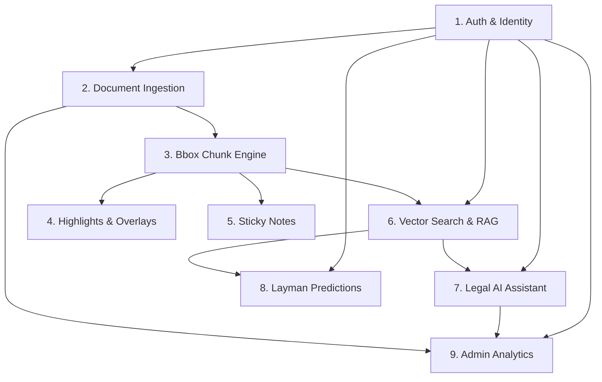

# LexLink Skills & Capabilities Catalog

This document details all 9 feature capability domains in LexLink. Each skill defines its API endpoint, execution lifecycle, accessible roles, rate limits, token quotas, and system dependencies.

---

## 🗺️ Skill Dependency Graph



---

## 1. Authentication & Identity (`auth.*`)

### `auth.signup`
- **Endpoint:** `POST /api/auth/signup`
- **Roles:** All (Public)
- **Description:** Registers a new user account with default `layman` role and dispatches verification OTP.
- **Rate Limit:** 5 requests / minute / IP
- **Input:** `{ "email": "user@example.com", "password": "SecurePassword123!", "full_name": "Hamza Khan" }`
- **Output:** `{ "success": true, "user_id": "uuid", "message": "Verification email sent." }`

### `auth.login`
- **Endpoint:** `POST /api/auth/login`
- **Roles:** All (Public)
- **Description:** Authenticates credentials and returns JWT Access Token (15 min) and Refresh Token (7 days).
- **Rate Limit:** 10 requests / minute / IP
- **Input:** `{ "email": "user@example.com", "password": "SecurePassword123!" }`
- **Output:** `{ "access_token": "jwt...", "refresh_token": "jwt...", "token_type": "bearer", "user": { "id": "uuid", "role": "lawyer", "name": "..." } }`

### `auth.submit_verification`
- **Endpoint:** `POST /api/auth/verify-role`
- **Roles:** Layman, Student, Lawyer
- **Description:** Submits student or lawyer credentials (Bar ID, Student Card) for role upgrade.
- **Rate Limit:** 3 requests / hour / user

---

## 2. Document Ingestion & Pipeline (`documents.*`)

### `documents.upload_stream`
- **Endpoint:** `POST /api/documents/upload`
- **Roles:** Student, Lawyer, Admin
- **Description:** Receives a PDF judgment, sanitizes path, extracts text/bbox metadata via PyMuPDF in a streaming NDJSON pipeline, and generates vector chunks.
- **Rate Limit:** Student: 10 uploads/day | Lawyer: 50 uploads/day | Admin: Unlimited
- **Input:** `multipart/form-data` with `file: Binary PDF`, `dry_run: boolean`
- **Streaming Output (NDJSON):**
  ```json
  {"type": "progress", "stage_index": 0, "stage_name": "Upload"}
  {"type": "progress", "stage_index": 1, "stage_name": "Parse & Extract"}
  {"type": "progress", "stage_index": 2, "stage_name": "Chunk & Embed"}
  {"type": "final", "success": true, "metadata": {"case_number": "SC-102/2023", "court": "Supreme Court"}, "total_chunks": 42}
  ```

### `documents.list`
- **Endpoint:** `GET /api/documents`
- **Roles:** Student, Lawyer, Admin
- **Description:** Retrieves paginated list of uploaded and public judgments with search/filter options.

---

## 3. Bounding-Box Chunks & Document Viewer (`chunks.*`)

### `chunks.get_document_chunks`
- **Endpoint:** `GET /api/documents/{document_id}/chunks`
- **Roles:** Student, Lawyer, Admin
- **Description:** Retrieves granular chunks with page numbers, bounding box rectangles (`[x0, y0, x1, y1]`), and paragraph hierarchy for precise PDF overlay rendering.
- **Rate Limit:** 60 requests / minute / user
- **Output:**
  ```json
  {
    "document_id": "uuid",
    "chunks": [
      {
        "chunk_id": "uuid",
        "page_number": 3,
        "bbox": [72.0, 140.5, 520.0, 210.2],
        "text": "The doctrine of legitimate expectation applies...",
        "chunk_type": "legal_reasoning"
      }
    ]
  }
  ```

---

## 4. Highlighting & Annotations (`highlights.*`)

### `highlights.create`
- **Endpoint:** `POST /api/documents/{document_id}/highlights`
- **Roles:** Student, Lawyer, Admin
- **Description:** Persists a visual highlight overlay tied to specific chunk bounding boxes or raw PDF coordinates with user color tags.
- **Input:** `{ "chunk_id": "uuid", "page_number": 3, "bbox": [72, 140, 520, 210], "color": "#7FA89A", "label": "Key Ratio" }`

### `highlights.delete`
- **Endpoint:** `DELETE /api/highlights/{highlight_id}`
- **Roles:** Student, Lawyer, Admin (Owner only)

---

## 5. Sticky Notes & Workspace Collaboration (`notes.*`)

### `notes.create`
- **Endpoint:** `POST /api/documents/{document_id}/notes`
- **Roles:** Student, Lawyer, Admin
- **Description:** Creates an interactive sticky note attached to a specific page or coordinate in the judgment.
- **Input:** `{ "page_number": 3, "position_x": 540, "position_y": 150, "content": "Review citation with 2021 PLD 450", "is_private": true }`

### `notes.list`
- **Endpoint:** `GET /api/documents/{document_id}/notes`
- **Roles:** Student, Lawyer, Admin

---

## 6. Vector Search & RAG Retrieval (`search.*`, `rag.*`)

### `search.vector_search`
- **Endpoint:** `POST /api/search/vector`
- **Roles:** Student, Lawyer, Admin
- **Description:** Performs high-dimensional dense vector similarity search in Qdrant using embeddings (`all-MiniLM-L6-v2` or `text-embedding-3-small`) with score thresholding and metadata filters.
- **Rate Limit:** Student: 30 req/min | Lawyer: 100 req/min | Admin: Unlimited
- **Input:** `{ "query": "bail in non-bailable offense under section 497", "filters": { "court": "Supreme Court", "year_from": 2018 }, "top_k": 10 }`
- **Output:**
  ```json
  {
    "query": "...",
    "results": [
      {
        "document_id": "uuid",
        "case_title": "State vs. Farooq",
        "citation": "2022 SCMR 112",
        "score": 0.892,
        "matched_chunk": "...",
        "page_number": 4
      }
    ]
  }
  ```

---

## 7. AI Legal Assistant & Chat Sessions (`chat.*`)

### `chat.create_session`
- **Endpoint:** `POST /api/chat/sessions`
- **Roles:** Student, Lawyer, Admin
- **Description:** Initializes a dedicated conversational thread scoped to a specific document or global legal knowledge.

### `chat.stream_message`
- **Endpoint:** `POST /api/chat/sessions/{session_id}/message`
- **Roles:** Student, Lawyer, Admin
- **Description:** Streams Claude 3.5 Sonnet / OpenAI responses with retrieved RAG context, citation citations, and interactive chunk jump-links.
- **Token Quota:** Student: 50,000 tokens/day | Lawyer: 500,000 tokens/day | Admin: Unlimited
- **Input:** `{ "message": "What was the core ratio regarding jurisdiction?", "document_id": "uuid" }`
- **Output (Server-Sent Events):**
  ```
  event: chunk
  data: {"delta": "The court held that..."}

  event: citation
  data: {"citation": "Para 14, Page 6", "chunk_id": "uuid", "bbox": [...]}

  event: done
  data: {"total_tokens": 842}
  ```

---

## 8. Layman Case Prediction & Legal Dictionary (`predictions.*`, `dictionary.*`)

### `predictions.case_outcome`
- **Endpoint:** `POST /api/predictions/outcome`
- **Roles:** Layman, Student, Lawyer, Admin
- **Description:** Generates a simplified, plain-language probability analysis and plain-English breakdown of legal scenarios based on past judicial precedents.
- **Rate Limit:** Layman: 5 req/day | Student/Lawyer: 50 req/day
- **Input:** `{ "matter_type": "Tenant Eviction", "facts_summary": "Landlord did not give 30 days notice...", "province": "Punjab" }`
- **Output:**
  ```json
  {
    "favorable_probability": 0.75,
    "confidence": "Moderate-High",
    "key_precedent_ratio": "Notice period under Section 15 of Rent Restriction Act is mandatory.",
    "layman_summary": "Under the law, your landlord must provide proper written notice...",
    "disclaimer": "This is an AI-assisted informational estimate and does not constitute formal legal counsel."
  }
  ```

### `dictionary.lookup`
- **Endpoint:** `GET /api/dictionary/terms?q={term}`
- **Roles:** All (Public)
- **Description:** Retrieves Urdu & English legal terminology definitions, Latin legal maxims (e.g., *Res Judicata*, *Prima Facie*), and practical examples.

---

## 9. Admin Analytics & Token Tracking (`admin.*`, `tokens.*`)

### `admin.get_analytics`
- **Endpoint:** `GET /api/admin/analytics/overview`
- **Roles:** Admin Only
- **Description:** Aggregates real-time metrics: active users, total ingested judgments, Qdrant vector count, API error rates, and verification backlog.

### `admin.token_usage`
- **Endpoint:** `GET /api/admin/tokens/usage`
- **Roles:** Admin Only
- **Description:** Detailed per-user, per-role, and per-model LLM token consumption and cost attribution.
